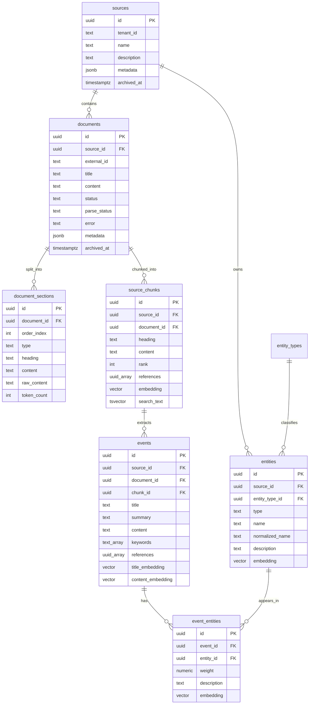
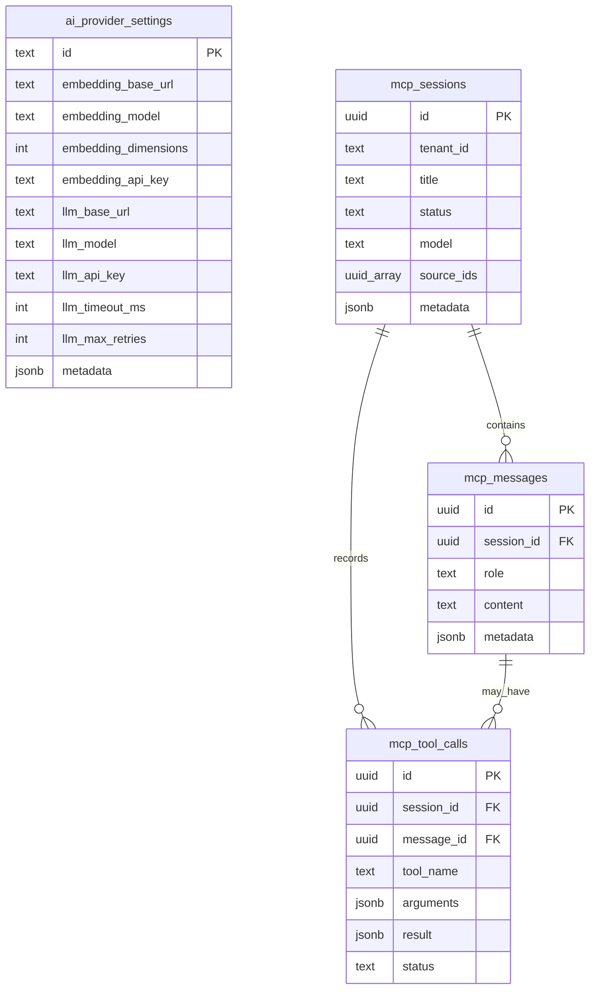

# DB Schema Notes

Tài liệu này ghi chú thiết kế database của SAG trong repo hiện tại. SAG không dùng một vector database tách riêng như Pinecone, Qdrant hay Milvus. Thay vào đó, PostgreSQL vừa lưu dữ liệu nghiệp vụ, vừa đóng vai trò vector store nhờ extension `pgvector`.

## Tổng Quan

Sơ đồ dưới đây chỉ giữ các bảng lõi của pipeline tài liệu và search. Mình tách `ai_provider_settings` ra khỏi ER diagram chính để tránh lỗi render đường self-loop trong Mermaid preview.



Thiết kế cốt lõi:

```text
project/source -> document -> section -> chunk -> event
                                      event <-> entity
```

Trong UI, `sources` gần tương đương một project. `documents` là tài liệu được upload vào project. `source_chunks`, `events`, `entities` và `event_entities` tạo thành graph nhẹ để search đa-hop.

## Bảng Cấu Hình Và MCP

Các bảng này không nằm trong graph truy hồi chính, nhưng phục vụ cấu hình model và hội thoại agent/MCP.



`ai_provider_settings` là singleton: constraint trong migration bắt buộc `id = 'global'`, nên bảng này chỉ có một row cấu hình chung.

## Giải Thích Các Khái Niệm Hay Gặp

### `tenant_id`

`tenant_id` là mã phân vùng dữ liệu theo tenant/người dùng/tổ chức. Repo hiện tại mặc định `DEFAULT_TENANT_ID=default`, nên nếu bạn chạy local một mình thì hầu như mọi record đều có `tenant_id = 'default'`.

Ví dụ:

```text
default
company_a
team_research
user_123
```

Ý nghĩa thực tế: khi có nhiều nhóm dùng chung một database, `tenant_id` giúp API chỉ nhìn thấy dữ liệu thuộc tenant của nó. Trong code hiện tại, search gọi `assertSourcesAccessible(sourceIds, tenantId)` để đảm bảo source thuộc tenant hiện tại và chưa bị archive.

### `metadata`

`metadata` là cột `jsonb` để lưu thông tin phụ, linh hoạt hơn các cột cố định. Nó thường dùng cho thông tin không cần query thường xuyên hoặc có thể thay đổi theo tính năng.

Ví dụ metadata của `sources` sau ingest:

```json
{
  "traceId": "9d8a2a7d-9f4b-4d4c-a0f5-0bb4f3330d4c",
  "chunking": {
    "mode": "heading_strict",
    "maxTokens": 512,
    "overlapTokens": 100
  },
  "uploadedBy": "local-user"
}
```

Ví dụ metadata của `documents`:

```json
{
  "fileName": "product-notes.md",
  "mimeType": "text/markdown",
  "chunking": {
    "mode": "token",
    "maxTokens": 512,
    "overlapTokens": 100
  }
}
```

Ví dụ metadata của `events`:

```json
{
  "traceId": "9d8a2a7d-9f4b-4d4c-a0f5-0bb4f3330d4c"
}
```

### `status` và `parse_status`

Hai trường này đang là `text`, chưa bị ràng buộc enum ở database. Theo code hiện tại:

- Khi insert document: `status = 'PARSING'`, `parse_status = 'PARSING'`.
- Khi ingest xong: cả hai được update thành `COMPLETED`.
- Schema default ban đầu là `PENDING`.

Các trạng thái hợp lý theo thiết kế pipeline:

| Giá trị | Ý nghĩa |
| --- | --- |
| `PENDING` | Đã tạo record nhưng chưa bắt đầu xử lý |
| `PARSING` | Đang đọc/chunk tài liệu hoặc đang trong pipeline ingest |
| `COMPLETED` | Xử lý thành công |
| `FAILED` | Xử lý lỗi, thông tin lỗi có thể nằm ở `error` |

Lưu ý: `IngestProgressStage` trong `src/types.ts` có nhiều stage chi tiết hơn như `CHUNKING`, `EMBEDDING_CHUNKS`, `EXTRACTING_EVENTS`, `WRITING_GRAPH`. Những stage đó dùng cho progress event, không phải enum cột `documents.status`.

### `archived_at` và `deleted_at`

- `sources.archived_at`: project bị archive mềm.
- `documents.archived_at`: document bị archive mềm.
- `events.deleted_at`: event bị delete mềm.

Nếu giá trị là `null`, record còn active. Nếu có timestamp, search thường loại bỏ record đó.

Ví dụ:

```text
archived_at = null
archived_at = 2026-07-07T09:30:00.000Z
```

### `rank` và `order_index`

- `document_sections.order_index`: thứ tự section trong document.
- `source_chunks.rank`: thứ tự chunk trong document.
- `events.rank`: thứ tự event trong document/chunk extraction output.

Ví dụ document có 3 heading:

```text
document_sections.order_index = 0, 1000, 2000
source_chunks.rank = 0, 1, 2
events.rank = 0, 1, 2
```

`rank` giúp UI và API trả nội dung theo đúng thứ tự gốc, thay vì theo UUID.

### `references`

`references` là mảng UUID trỏ về `document_sections.id`.

Ví dụ:

```json
[
  "2d19e9d0-59ef-49aa-8a2a-3e16a3c5e291",
  "0c19b9ce-2f8f-4f11-b276-c5d70c93ddab"
]
```

Ý nghĩa:

- `source_chunks.references`: chunk này được tạo từ section nào.
- `events.references`: event này lấy bằng chứng từ section nào.

Nhờ đó khi UI hiển thị citation hoặc chi tiết event, hệ thống có thể quay về đoạn gốc.

### `search_text`

`search_text` là cột generated `tsvector`, không cần app tự ghi. PostgreSQL tự tạo từ text khác.

Ví dụ trong `entities`:

```sql
to_tsvector('simple', coalesce(name, '') || ' ' || coalesce(normalized_name, '') || ' ' || coalesce(description, ''))
```

Nó phục vụ full-text search/BM25-like search ở fast mode.

### `embedding`

Các cột `embedding`, `title_embedding`, `content_embedding` là `vector(1024)`. App ghi vào bằng helper `toVectorLiteral(...)`, sau đó query bằng pgvector cosine distance.

Ví dụ ý tưởng:

```text
[0.012, -0.083, 0.441, ..., 0.029]  -- đủ 1024 số
```

Trong API list/detail, code chỉ trả preview vài số đầu để debug, không trả toàn bộ vector dài.

## Các Bảng Chính Và Ví Dụ Field

### `sources`

Lưu project hoặc nguồn dữ liệu cấp cao.

| Trường | Ý nghĩa | Ví dụ |
| --- | --- | --- |
| `id` | UUID của project/source | `f8b1c4d2-...` |
| `tenant_id` | Tenant sở hữu source | `default`, `team_ai` |
| `name` | Tên project hiển thị | `SAG Demo Project` |
| `description` | Mô tả project | `Internal product docs` |
| `metadata` | Thông tin phụ dạng JSON | `{ "traceId": "...", "chunking": { "mode": "heading_strict" } }` |
| `archived_at` | Thời điểm archive mềm | `null` hoặc timestamp |

Ví dụ row:

```json
{
  "id": "11111111-1111-4111-8111-111111111111",
  "tenant_id": "default",
  "name": "SAG Demo Project",
  "description": "Created by SAG ingestDocument",
  "metadata": {
    "traceId": "aaaaaaaa-aaaa-4aaa-8aaa-aaaaaaaaaaaa",
    "chunking": {
      "mode": "heading_strict",
      "maxTokens": 512,
      "overlapTokens": 100
    }
  },
  "archived_at": null
}
```

Quan hệ quan trọng:

- Một `source` có nhiều `documents`.
- Một `source` có nhiều `source_chunks`, `events`, `entities`.

### `documents`

Lưu tài liệu gốc đã upload.

| Trường | Ý nghĩa | Ví dụ |
| --- | --- | --- |
| `id` | UUID document | `22222222-2222-4222-8222-222222222222` |
| `source_id` | Project chứa document | `sources.id` |
| `external_id` | ID ngoài hệ thống, hiện thường null | `notion-page-123`, `null` |
| `title` | Tên tài liệu | `Product Pricing.md` |
| `content` | Nội dung gốc | `# Pricing\n\nSAG Pro costs...` |
| `status` | Trạng thái xử lý tổng quát | `PENDING`, `PARSING`, `COMPLETED`, `FAILED` |
| `parse_status` | Trạng thái parse/ingest | `PARSING`, `COMPLETED` |
| `error` | Message lỗi nếu failed | `Embedding API timeout` |
| `metadata` | File info, chunking config, trace | `{ "fileName": "pricing.md" }` |
| `archived_at` | Archive mềm document | `null` hoặc timestamp |

Ví dụ row:

```json
{
  "id": "22222222-2222-4222-8222-222222222222",
  "source_id": "11111111-1111-4111-8111-111111111111",
  "title": "Product Pricing.md",
  "content": "# Pricing\n\nSAG Pro costs $29/month and includes graph search.",
  "status": "COMPLETED",
  "parse_status": "COMPLETED",
  "metadata": {
    "fileName": "Product Pricing.md",
    "chunking": {
      "mode": "heading_strict",
      "maxTokens": 512,
      "overlapTokens": 100
    }
  },
  "archived_at": null
}
```

### `document_sections`

Lưu các đoạn section sau bước parsing/chunking.

| Trường | Ý nghĩa | Ví dụ |
| --- | --- | --- |
| `id` | UUID section | `33333333-3333-4333-8333-333333333333` |
| `document_id` | Document gốc | `documents.id` |
| `order_index` | Thứ tự section | `0`, `1000`, `2000` |
| `render_group_index` | Nhóm render, hiện thường `0` | `0` |
| `type` | Loại section | `TEXT` |
| `heading` | Heading chính | `Pricing` |
| `content` | Text sạch | `Pricing SAG Pro costs $29/month...` |
| `raw_content` | Markdown gốc | `# Pricing\n\nSAG Pro costs...` |
| `image_url` | URL ảnh nếu có, hiện thường null | `null` |
| `metadata` | Metadata phụ | `{}` |
| `token_count` | Số token ước lượng | `18` |

Ví dụ row:

```json
{
  "id": "33333333-3333-4333-8333-333333333333",
  "document_id": "22222222-2222-4222-8222-222222222222",
  "order_index": 0,
  "type": "TEXT",
  "heading": "Pricing",
  "content": "Pricing SAG Pro costs $29/month and includes graph search.",
  "raw_content": "# Pricing\n\nSAG Pro costs $29/month and includes graph search.",
  "token_count": 18
}
```

### `source_chunks`

Lưu chunk dùng làm bằng chứng cuối cùng khi trả kết quả search.

| Trường | Ý nghĩa | Ví dụ |
| --- | --- | --- |
| `id` | UUID chunk | `44444444-4444-4444-8444-444444444444` |
| `source_id` | Project chứa chunk | `sources.id` |
| `document_id` | Document gốc | `documents.id` |
| `source_type` | Loại nguồn | `ARTICLE` |
| `external_source_id` | ID ngoài, code đang dùng document id dạng text | `22222222-...` |
| `heading` | Heading chunk | `Pricing` |
| `content` | Nội dung sạch dùng làm context | `Pricing SAG Pro costs...` |
| `raw_content` | Markdown gốc | `# Pricing\n\nSAG Pro costs...` |
| `rank` | Thứ tự chunk | `0` |
| `references` | Section ids tạo nên chunk | `[ "33333333-..." ]` |
| `metadata` | Metadata phụ | `{}` |
| `embedding` | Vector của heading + content | `vector(1024)` |
| `search_text` | Generated full-text index | tự sinh |

Ví dụ row:

```json
{
  "id": "44444444-4444-4444-8444-444444444444",
  "source_id": "11111111-1111-4111-8111-111111111111",
  "document_id": "22222222-2222-4222-8222-222222222222",
  "source_type": "ARTICLE",
  "heading": "Pricing",
  "content": "Pricing SAG Pro costs $29/month and includes graph search.",
  "rank": 0,
  "references": ["33333333-3333-4333-8333-333333333333"],
  "embedding": "[1024-dimensional vector]"
}
```

Index quan trọng:

- `source_chunks_embedding_hnsw`: HNSW cosine index cho vector search.
- `source_chunks_search_text_idx`: GIN index cho full-text search.
- `source_chunks_source_document_rank_idx`: duyệt chunk theo document.

### `events`

Lưu event được LLM trích xuất từ chunk. Hiện tại mỗi chunk lấy tối đa 1 event.

| Trường | Ý nghĩa | Ví dụ |
| --- | --- | --- |
| `id` | UUID event | `55555555-5555-4555-8555-555555555555` |
| `source_id` | Project chứa event | `sources.id` |
| `document_id` | Document gốc | `documents.id` |
| `chunk_id` | Chunk sinh ra event | `source_chunks.id` |
| `source_type` | Loại nguồn | `ARTICLE` |
| `external_source_id` | ID ngoài, hiện là document id dạng text | `22222222-...` |
| `parent_id` | Event cha nếu có hierarchy | `null` |
| `level` | Cấp event trong hierarchy | `0` |
| `rank` | Thứ tự event | `0` |
| `title` | Tiêu đề event | `SAG Pro pricing includes graph search` |
| `summary` | Tóm tắt event | `SAG Pro costs $29/month...` |
| `content` | Nội dung event đầy đủ | `SAG Pro costs $29/month and includes graph search.` |
| `category` | Nhóm event do LLM gợi ý | `pricing`, `release`, `policy`, `null` |
| `keywords` | Keywords | `[ "SAG Pro", "pricing", "graph search" ]` |
| `priority` | Độ ưu tiên do extractor trả | `UNKNOWN`, `HIGH`, `MEDIUM`, `LOW` |
| `status` | Trạng thái event do extractor trả | `COMPLETED`, `PENDING`, `UNKNOWN` |
| `start_time`, `end_time` | Thời gian event nếu có | `null`, timestamp |
| `references` | Section ids liên quan | `[ "33333333-..." ]` |
| `metadata` | Trace hoặc metadata phụ | `{ "traceId": "..." }` |
| `title_embedding` | Vector title | `vector(1024)` |
| `content_embedding` | Vector title + content | `vector(1024)` |
| `deleted_at` | Soft delete event | `null` |

`priority` và `status` hiện cũng là `text`, không bị database ép enum. Code default:

```text
priority = event.priority ?? "UNKNOWN"
status = event.status ?? "COMPLETED"
```

Ví dụ row:

```json
{
  "id": "55555555-5555-4555-8555-555555555555",
  "chunk_id": "44444444-4444-4444-8444-444444444444",
  "rank": 0,
  "title": "SAG Pro pricing includes graph search",
  "summary": "SAG Pro costs $29/month and includes graph search.",
  "content": "SAG Pro costs $29/month and includes graph search.",
  "category": "pricing",
  "keywords": ["SAG Pro", "pricing", "graph search"],
  "priority": "UNKNOWN",
  "status": "COMPLETED",
  "references": ["33333333-3333-4333-8333-333333333333"],
  "metadata": {
    "traceId": "aaaaaaaa-aaaa-4aaa-8aaa-aaaaaaaaaaaa"
  }
}
```

Index quan trọng:

- `events_title_embedding_hnsw`: tìm event theo query gần title.
- `events_content_embedding_hnsw`: coarse rank event bằng nội dung.
- `events_search_text_idx`: full-text search event.

### `entity_types`

Lưu cấu hình loại entity.

| Trường | Ý nghĩa | Ví dụ |
| --- | --- | --- |
| `id` | UUID entity type | `66666666-...` |
| `source_id`, `document_id` | Scope riêng cho source/document nếu cần | `null` cho global |
| `scope` | Phạm vi áp dụng | `global`, `source`, `document` |
| `type` | Mã loại entity | `subject`, `person`, `organization`, `product` |
| `name` | Tên hiển thị | `Subject`, `Person` |
| `description` | Mô tả loại entity | `General concept or topic` |
| `weight` | Trọng số mặc định | `1.00` |
| `similarity_threshold` | Ngưỡng similarity mặc định | `0.8000` |
| `value_constraints` | Rule phụ dạng JSON | `{}` |
| `is_default` | Có phải default type không | `true`, `false` |
| `is_active` | Có đang dùng không | `true`, `false` |

Khi upsert entity, code tìm `entity_types.type = input.type and is_active = true`. Nếu không thấy, code dùng một default active type.

### `entities`

Lưu entity đã trích xuất từ event.

| Trường | Ý nghĩa | Ví dụ |
| --- | --- | --- |
| `id` | UUID entity | `77777777-7777-4777-8777-777777777777` |
| `source_id` | Project chứa entity | `sources.id` |
| `entity_type_id` | Loại entity trong `entity_types` | `entity_types.id` |
| `type` | Loại entity do extractor trả | `product`, `feature`, `organization` |
| `name` | Tên entity | `SAG Pro` |
| `normalized_name` | Tên chuẩn hóa lowercase | `sag pro` |
| `description` | Mô tả entity | `Paid SAG product plan` |
| `value_type` | Kiểu giá trị nếu entity là value | `number`, `datetime`, `boolean`, `null` |
| `value_raw` | Giá trị gốc | `$29/month`, `null` |
| `int_value`, `numeric_value` | Giá trị số đã parse | `29.000000` |
| `datetime_value` | Giá trị thời gian đã parse | timestamp hoặc `null` |
| `bool_value` | Giá trị boolean đã parse | `true`, `false`, `null` |
| `enum_value` | Giá trị enum nếu có | `enterprise`, `pro`, `null` |
| `value_unit` | Đơn vị | `USD/month`, `tokens`, `null` |
| `value_confidence` | Độ tin cậy khi parse value | `0.9500`, `null` |
| `embedding` | Vector entity name | `vector(1024)` |
| `metadata` | Metadata phụ | `{}` |

Ví dụ row:

```json
{
  "id": "77777777-7777-4777-8777-777777777777",
  "source_id": "11111111-1111-4111-8111-111111111111",
  "type": "product",
  "name": "SAG Pro",
  "normalized_name": "sag pro",
  "description": "Paid SAG product plan",
  "embedding": "[1024-dimensional vector]"
}
```

Ràng buộc quan trọng:

```text
unique(source_id, type, normalized_name)
```

Nhờ vậy cùng một entity trong một project được gom lại, thay vì tạo bản ghi trùng cho mỗi chunk.

### `event_entities`

Đây là bảng cạnh của graph event-entity.

| Trường | Ý nghĩa | Ví dụ |
| --- | --- | --- |
| `id` | UUID edge | `88888888-8888-4888-8888-888888888888` |
| `event_id` | Event đầu mối | `events.id` |
| `entity_id` | Entity xuất hiện trong event | `entities.id` |
| `weight` | Trọng số quan hệ | `1.0` |
| `description` | Mô tả entity trong ngữ cảnh event | `Feature included in SAG Pro` |
| `embedding` | Vector relation description | `vector(1024)` |
| `metadata` | Metadata phụ | `{}` |

Ví dụ row:

```json
{
  "id": "88888888-8888-4888-8888-888888888888",
  "event_id": "55555555-5555-4555-8555-555555555555",
  "entity_id": "77777777-7777-4777-8777-777777777777",
  "weight": 1.0,
  "description": "Paid SAG product plan mentioned in the pricing event",
  "embedding": "[1024-dimensional vector]"
}
```

Bảng này giúp SAG mở rộng multi-hop:

```text
matched entity -> related events -> new entities -> more related events
```

### `ai_provider_settings`

Bảng singleton lưu cấu hình model toàn cục.

| Trường | Ý nghĩa | Ví dụ |
| --- | --- | --- |
| `id` | Bắt buộc là `global` | `global` |
| `embedding_base_url` | Base URL embedding API | `https://api.302ai.cn/v1` |
| `embedding_model` | Tên embedding model | `text-embedding-3-large` |
| `embedding_dimensions` | Số chiều embedding | `1024` |
| `embedding_api_key` | API key embedding, có thể null | `null`, `sk-...` |
| `llm_base_url` | Base URL LLM API | `https://api.302ai.cn/v1` |
| `llm_model` | Tên LLM | `qwen3.6-flash` |
| `llm_api_key` | API key LLM, có thể null | `null`, `sk-...` |
| `llm_timeout_ms` | Timeout gọi LLM | `60000` |
| `llm_max_retries` | Số lần retry | `2` |
| `metadata` | Cấu hình phụ | `{ "defaultSearchMode": "fast" }` |

`embedding_dimensions` bị giới hạn là `1024` để khớp các cột `vector(1024)`.

## Vector DB Lưu Những Gì?

Trong dự án này, "vector DB" chính là PostgreSQL + pgvector. Các vector không nằm ở service ngoài, mà nằm trong các cột sau:

| Bảng | Cột vector | Sinh từ text nào | Dùng để làm gì |
| --- | --- | --- | --- |
| `source_chunks` | `embedding` | `${chunk.heading}\n${chunk.content}` | Fallback vector search và RAG truyền thống |
| `events` | `title_embedding` | `event.title` | Recall event có title gần query |
| `events` | `content_embedding` | `${event.title}\n\n${event.content}` | Coarse rank event candidate |
| `entities` | `embedding` | `entity.name` | Recall entity bằng vector trong standard mode |
| `event_entities` | `embedding` | `entity.description` hoặc `${eventTitle} ${entityName}` | Biểu diễn quan hệ event-entity, dành cho mở rộng/chấm điểm quan hệ về sau |

Tất cả các vector hiện được thiết kế là `vector(1024)`. Nếu đổi embedding model sang model có dimension khác, schema và config cũng phải đổi theo.

## Ví Dụ End-To-End Một Document Được Ghi Vào DB

Input:

```markdown
# Pricing

SAG Pro costs $29/month and includes graph search.
```

Các record quan trọng có thể được tạo:

```text
sources
  name = "Product Pricing.md"
  tenant_id = "default"
  metadata.chunking.mode = "heading_strict"

documents
  title = "Product Pricing.md"
  status = "COMPLETED"
  parse_status = "COMPLETED"

document_sections
  heading = "Pricing"
  raw_content = "# Pricing\n\nSAG Pro costs $29/month and includes graph search."

source_chunks
  heading = "Pricing"
  content = "Pricing SAG Pro costs $29/month and includes graph search."
  embedding = vector(heading + content)

events
  title = "SAG Pro pricing includes graph search"
  content = "SAG Pro costs $29/month and includes graph search."
  title_embedding = vector(title)
  content_embedding = vector(title + content)

entities
  name = "SAG Pro"
  normalized_name = "sag pro"
  embedding = vector("SAG Pro")

event_entities
  event_id = pricing_event_id
  entity_id = sag_pro_entity_id
  description = "Paid SAG product plan mentioned in the pricing event"
```

## Vì Sao Không Chỉ Lưu Chunk Vector?

RAG truyền thống thường chỉ có:

```text
query embedding -> nearest chunks -> answer
```

SAG lưu thêm event/entity để tạo lớp truy hồi có cấu trúc:

```text
query -> entity match -> event recall -> graph expansion -> event rerank -> source chunks
```

Ý nghĩa của từng tầng:

- Chunk giữ bằng chứng nguyên văn.
- Event giữ đơn vị ngữ nghĩa hoàn chỉnh.
- Entity giữ điểm nối giữa nhiều event.
- `event_entities` giữ cạnh graph để đi multi-hop.

Ví dụ: một tài liệu nói "OpenAI phát hành model A", tài liệu khác nói "model A được dùng trong sản phẩm B". Nếu query hỏi "sản phẩm B liên quan gì tới OpenAI?", vector chunk search có thể bỏ lỡ một trong hai chunk. SAG có thể đi qua entity `model A` để nối hai event.

## Full-Text Search Và Vector Search

Database kết hợp nhiều kiểu index:

```text
GIN tsvector       -> keyword/BM25-like search
GIN trigram        -> fuzzy entity name match
HNSW vector index  -> cosine nearest-neighbor search
B-tree indexes     -> lọc theo source/document/status/rank
```

Trong fast mode, entity recall ưu tiên `entities.search_text` và trigram. Trong standard mode, query entity do LLM trích xuất sẽ được match theo tên và vector.

## Ghi Chú Vận Hành

- Cần extension PostgreSQL: `vector`, `pg_trgm`, `unaccent`, `uuid-ossp`.
- `pgvector` dùng toán tử `<=>` cho cosine distance.
- Score trong repository thường tính là `1 - (embedding <=> queryVector)`.
- `archived_at` dùng cho soft archive project/document; search loại bỏ dữ liệu archived.
- `events.deleted_at` dùng cho soft delete event.
- `source_chunks.references` và `events.references` trỏ về `document_sections.id`, giúp UI quay lại đoạn gốc.
- Các cột trạng thái hiện là `text`, nên nếu muốn chặt hơn có thể thêm CHECK constraint hoặc PostgreSQL enum trong migration tương lai.
