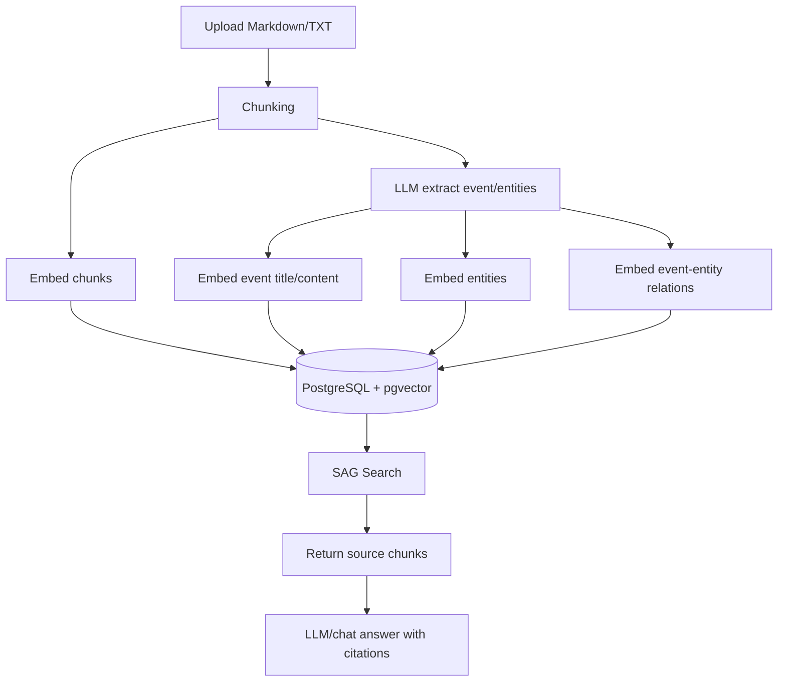
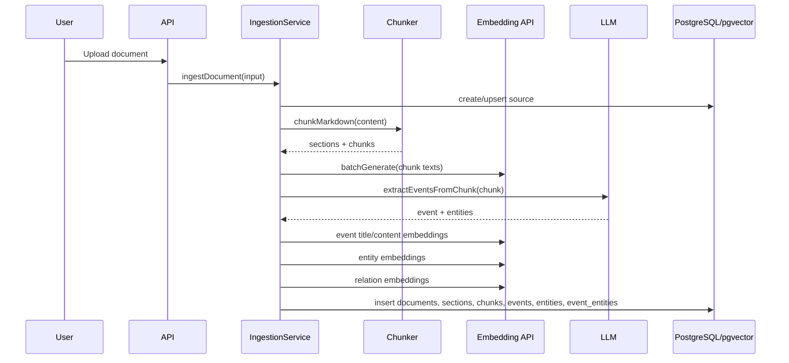
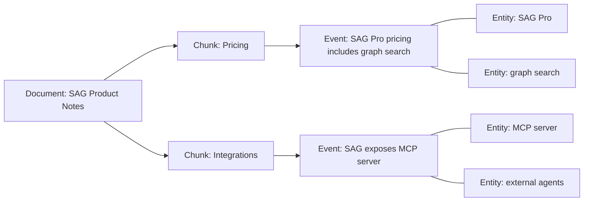
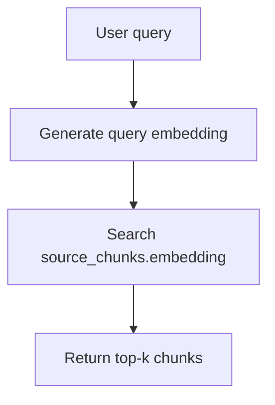
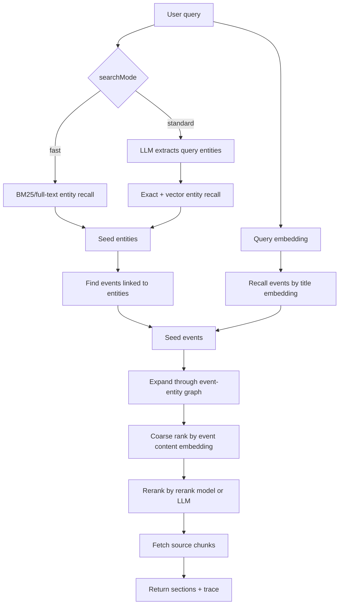
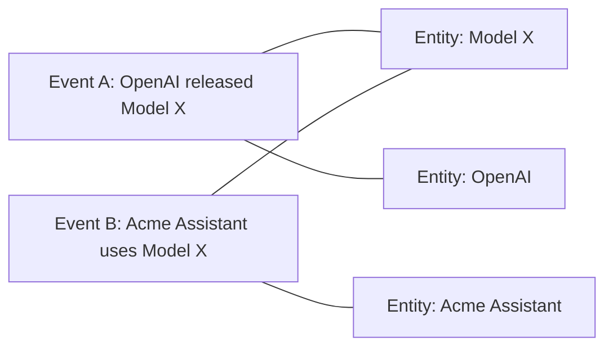
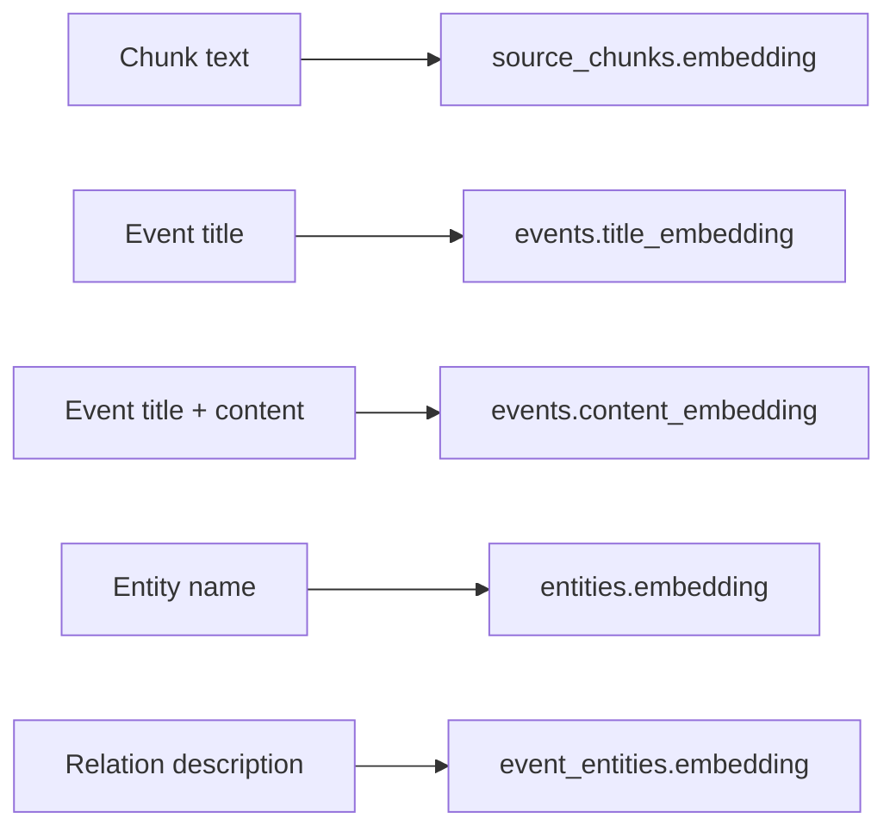

# SAG Pipeline

Tài liệu này giải thích luồng hoạt động của SAG trong repo hiện tại: từ lúc upload tài liệu, ghi database/vector, đến khi user hỏi và hệ thống trả về context.

## Bức Tranh Tổng Thể



SAG có hai phần lớn:

- **Ingestion pipeline**: biến tài liệu thành chunks, events, entities, relations và vectors.
- **Search pipeline**: dùng query để recall entity/event, mở rộng graph, rerank event, rồi lấy chunk gốc làm context.

## 1. Ingestion Pipeline

Code chính nằm ở `src/services/ingestion-service.ts`.



### Bước 1: Nhận Document

Input điển hình:

```json
{
  "sourceId": "project_id",
  "title": "SAG Product Notes",
  "content": "# Pricing\n\nSAG Pro costs $29/month and includes graph search.",
  "extract": true,
  "chunking": {
    "mode": "heading_strict"
  }
}
```

`sourceId` là project hiện tại. Nếu không truyền `sourceId`, service có thể tạo source mới.

### Bước 2: Chunking

Code chunking nằm ở `src/ingestion/chunking/markdown.ts`.

Có hai mode:

- `heading_strict`: mỗi heading chính tạo một section/chunk. Đây là default benchmark.
- `token`: chia theo cửa sổ token, có thể overlap.

Ví dụ tài liệu:

```markdown
# Pricing

SAG Pro costs $29/month and includes graph search.

# Integrations

SAG exposes an MCP server for external agents.
```

Với `heading_strict`, hệ thống tạo 2 chunk:

```text
chunk 0
heading: Pricing
content: Pricing SAG Pro costs $29/month and includes graph search.

chunk 1
heading: Integrations
content: Integrations SAG exposes an MCP server for external agents.
```

### Bước 3: Embed Chunk

Mỗi chunk được embed bằng text:

```text
${chunk.heading}
${chunk.content}
```

Vector được lưu vào:

```text
source_chunks.embedding
```

Vector này dùng cho:

- `strategy: "vector"` giống RAG truyền thống.
- Fallback khi SAG không recall được event.
- Bổ sung chunk nếu số context từ event chưa đủ.

### Bước 4: Extract Event Và Entity

Mỗi chunk được gửi vào LLM để trích xuất event/entities. Hàm `extractEventsFromChunk` lọc event rỗng và hiện lấy tối đa 1 event trên mỗi chunk.

Ví dụ từ chunk Pricing:

```json
{
  "title": "SAG Pro pricing includes graph search",
  "summary": "SAG Pro costs $29 per month and includes graph search.",
  "content": "SAG Pro costs $29/month and includes graph search.",
  "keywords": ["SAG Pro", "pricing", "graph search"],
  "references": ["section_id_pricing"],
  "entities": [
    {
      "type": "product",
      "name": "SAG Pro",
      "description": "Paid SAG product plan"
    },
    {
      "type": "feature",
      "name": "graph search",
      "description": "Retrieval feature included in SAG Pro"
    }
  ]
}
```

### Bước 5: Embed Event, Entity Và Relation

Service sinh nhiều loại vector khác nhau:

```text
events.title_embedding
  <- event.title

events.content_embedding
  <- event.title + "\n\n" + event.content

entities.embedding
  <- entity.name

event_entities.embedding
  <- entity.description
     hoặc event.title + " " + entity.name
```

Đây là điểm khác RAG truyền thống: hệ thống không chỉ embed chunk, mà còn embed event/entity/relation.

### Bước 6: Ghi Graph Vào Database

Trong transaction, hệ thống ghi:

```text
documents
document_sections
source_chunks
events
entities
event_entities
```

Sau ingestion, graph thực tế sẽ giống:



## 2. Search Pipeline

Code chính nằm ở `src/services/search-service.ts`.

SAG có hai strategy:

- `vector`: query embedding -> search chunk vector -> trả chunks.
- `multi`: SAG event/entity retrieval -> trả chunks. Đây là default.

## 3. Vector Search Strategy



Ví dụ query:

```text
What does SAG Pro include?
```

Luồng:

1. Embed query.
2. Tìm chunk gần nhất bằng `source_chunks.embedding`.
3. Trả các chunk có content gần query nhất.

Đây là baseline RAG truyền thống.

## 4. Multi Search Strategy



### Fast Mode

Fast mode không gọi LLM để tách entity từ query.

Luồng:

1. Dùng query text search trên `entities.search_text`.
2. Kết hợp trigram/fuzzy match qua `normalized_name`.
3. Lấy event liên quan từ `event_entities`.
4. Recall thêm event theo `events.title_embedding`.
5. Expand graph, coarse rank, rerank.

Phù hợp khi cần tốc độ và có entity names rõ trong query.

### Standard Mode

Standard mode gọi LLM để trích xuất entity từ query.

Luồng:

1. LLM đọc query và trả danh sách entity names.
2. Match entity bằng exact/fuzzy name.
3. Embed từng entity name trong query để search `entities.embedding`.
4. Tiếp tục các bước event recall, expansion và rerank.

Phù hợp khi query dài, mơ hồ, hoặc cần độ chính xác cao hơn.

## 5. Ví Dụ Thực Tế Multi-Hop

Giả sử project có 2 tài liệu.

Tài liệu A:

```markdown
# Launch

OpenAI released Model X in June. Model X focuses on tool use and long-context reasoning.
```

Tài liệu B:

```markdown
# Product

Acme Assistant uses Model X to analyze customer tickets and generate support actions.
```

Sau ingestion, graph có thể là:



User hỏi:

```text
How is Acme Assistant related to OpenAI?
```

RAG vector truyền thống có thể chỉ tìm thấy tài liệu B vì query nhắc "Acme Assistant", hoặc chỉ tìm tài liệu A vì nhắc "OpenAI". SAG có đường nối:

```text
Acme Assistant -> Event B -> Model X -> Event A -> OpenAI
```

Luồng SAG cụ thể:

1. Query được embed.
2. Fast mode tìm entity có liên quan: `Acme Assistant`, `OpenAI`, có thể cả `Model X` nếu text match.
3. Từ entity, lấy seed events:
   - Event B liên quan `Acme Assistant`.
   - Event A liên quan `OpenAI`.
4. Expand qua entity trong seed events:
   - Event B có `Model X`.
   - `Model X` dẫn tới Event A.
5. Coarse rank các events bằng `events.content_embedding`.
6. Rerank chọn Event A và Event B.
7. Fetch chunk gốc từ `source_chunks`.
8. LLM trả lời dựa trên hai bằng chứng:
   - OpenAI released Model X.
   - Acme Assistant uses Model X.

Kết luận mong muốn:

```text
Acme Assistant liên quan tới OpenAI vì nó dùng Model X, trong khi Model X là model do OpenAI phát hành.
```

## 6. Search Trace Ghi Lại Những Gì?

Khi gọi search với `returnTrace: true`, trace có thể gồm:

- `queryEntities`: entity suy ra từ query.
- `recalledEntities`: entity lấy từ DB.
- `entityEventIds`: event tìm qua entity.
- `queryEventIds`: event tìm qua title embedding.
- `expandedEventIds`: event tìm thêm qua graph expansion.
- `coarseRankedEventIds`: event sau bước rank bằng content embedding.
- `rerankedEventIds`: event cuối cùng sau rerank.
- `timings`: thời gian từng bước.

Trace giúp debug vì bạn nhìn được hệ thống bị mất thông tin ở bước nào: entity recall, event expansion, coarse rank hay rerank.

## 7. Khi Nào Hệ Thống Fallback Về Vector Search?

Trong `multiSearch`, nếu không có seed event nào từ entity recall hoặc title vector recall, hệ thống đặt:

```text
fallbackReason = "no seed events; used vector chunk search"
```

Sau đó chạy `vectorSearch` để vẫn trả được chunk gần query. Đây là cơ chế an toàn để SAG không trả rỗng khi graph chưa đủ tốt.

## 8. Vector DB Lưu Gì Trong Pipeline?

Trong ingestion, vector DB nhận 5 loại embedding:



Ý nghĩa thực tế:

- `source_chunks.embedding`: tìm đoạn văn bản gốc gần query.
- `events.title_embedding`: tìm event có tiêu đề gần ý định query.
- `events.content_embedding`: xếp hạng event theo nội dung đầy đủ.
- `entities.embedding`: tìm entity gần entity trong query.
- `event_entities.embedding`: lưu sắc thái quan hệ giữa event và entity.

## 9. API Ví Dụ

Ingest một tài liệu:

```bash
curl -X POST http://localhost:4173/ingest \
  -H 'Content-Type: application/json' \
  -d '{"sourceId":"project_id","title":"Demo","content":"# Launch\n\nOpenAI released Model X. Acme Assistant uses Model X.","extract":true}'
```

Search bằng SAG fast mode:

```bash
curl -X POST http://localhost:4173/api/search \
  -H 'Content-Type: application/json' \
  -d '{"query":"How is Acme Assistant related to OpenAI?","sourceIds":["project_id"],"strategy":"multi","searchMode":"fast","topK":5,"returnTrace":true}'
```

Search bằng vector baseline:

```bash
curl -X POST http://localhost:4173/api/search \
  -H 'Content-Type: application/json' \
  -d '{"query":"How is Acme Assistant related to OpenAI?","sourceIds":["project_id"],"strategy":"vector","topK":5}'
```

## 10. Tóm Tắt Ngắn

```text
Ingestion:
document -> chunks -> event/entities -> embeddings -> graph tables

Search:
query -> entity/event recall -> graph expansion -> event rank/rerank -> source chunks

Vector store:
PostgreSQL pgvector columns, not a separate vector DB service
```

SAG tối ưu hơn RAG truyền thống ở các câu hỏi cần nối nhiều mẩu thông tin. Chunk vẫn là bằng chứng cuối cùng, nhưng event/entity graph giúp hệ thống tìm đúng chunk tốt hơn.

